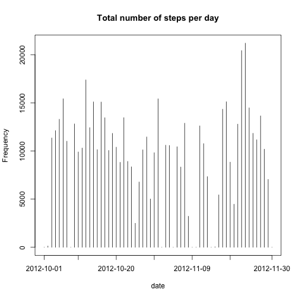
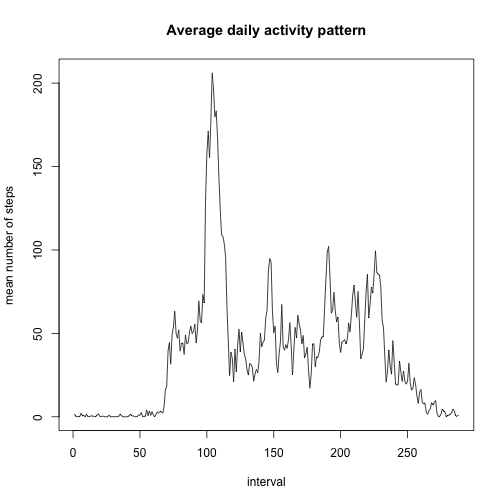
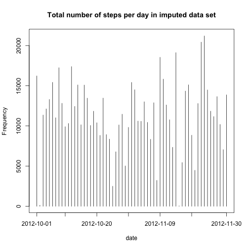
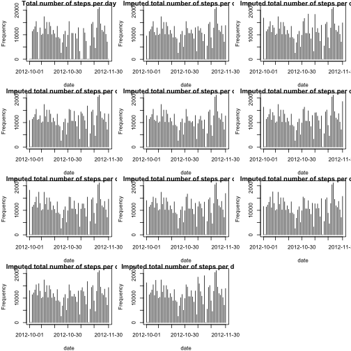
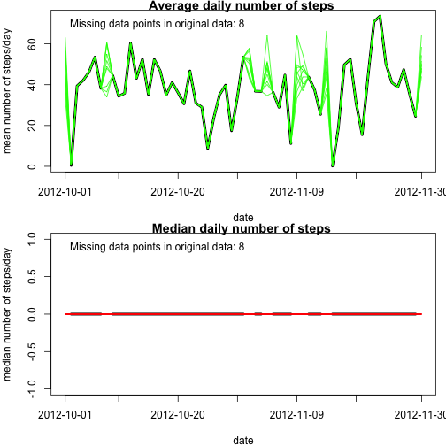
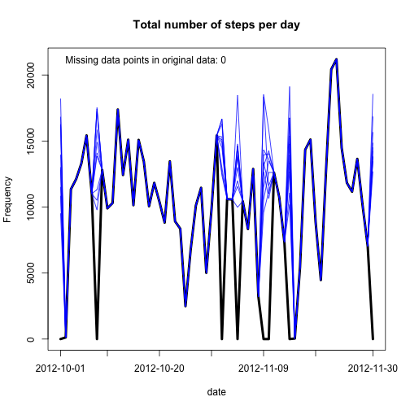
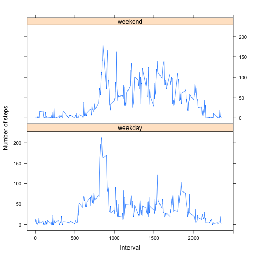

This assignment makes use of data from a personal activity monitoring device.
 This device collects data at 5 minute intervals through out the day. The data
 consists of two months of data from an anonymous individual collected during
 the months of October and November, 2012 and include the number of steps taken
 in 5 minute intervals each day.
 
 The data for this assignment can be downloaded from the course web site:
 
 Dataset: Activity monitoring data [52K] The variables included in this dataset
 are:
 
 steps: Number of steps taking in a 5-minute interval (missing values are coded
 as NA)
 date: The date on which the measurement was taken in YYYY-MM-DD
 format interval: Identifier for the 5-minute interval in which measurement was
 taken 

The dataset is stored in a comma-separated-value (CSV) file and there
 are a total of 17,568 observations in this dataset.


install.packages("downloader", lib="/Library/Frameworks/R.framework/Versions/3.2/Resources/library")
#   Code for reading in the dataset and/or processing the data   

```r
library(downloader)

fileURL<- 'https://github.com/janinaf/RepData_PeerAssessment1/blob/master/activity.zip'
download(fileURL, dest="/Volumes/DataDrive/Dropbox/Coursera-DataScience/ReproducibleScience/activity.zip", mode="wb") 
```
### unzip the file 

```r
activityData<- read.csv('/Volumes/DataDrive/Dropbox/Coursera-DataScience/ReproducibleScience/activity.csv', sep=',', header = TRUE)
```

# Histogram of the total number of steps taken each day   

        ###calculate total steps/day

```r
totalSteps<-with(activityData, tapply(steps, date, sum, na.rm=TRUE))
```
        ###extract labels of interest

```r
a<-unlist(attr(totalSteps, 'dimnames'))[c(1, 10, 20, 30, 40, 50, 61)]
```
        ###create and label the plot

```r
plot((1:length(totalSteps)), totalSteps, xaxt = 'n', xlab='date', ylab='Frequency', main = 'Total number of steps per day', "h")
axis(
        side = 1, at = c(1, 10,20,30,40,50,61), 
        labels = c(a)
)
```




# Mean and median number of steps taken each day      ########################

        ###extract these values in the two corresponding vectors

```r
meanSteps<-with(activityData, tapply(steps, date, mean, na.rm=TRUE))
medianSteps<-with(activityData, tapply(steps, date, median, na.rm=TRUE))
```

#   Time series plot of the average number of steps taken ########################


```r
timeSeriesSteps<-with(activityData, tapply(steps, interval, mean, na.rm=TRUE))
```
        ###create and label the plot

```r
plot((1:length(timeSeriesSteps)), timeSeriesSteps, xlab='interval', ylab='mean number of steps', main = 'Average daily activity pattern', "l")
```


#   The 5-minute interval that, on average, contains the maximum number of steps #############

```r
maxInterval=which.max(timeSeriesSteps)
print(maxInterval)
```

```
## 835 
## 104
```

#   Code to describe and show a strategy for imputing missing data   ######################

        ##  1. Calculate and report the total number of missing values in the dataset (i.e. the total number of rows with 𝙽𝙰s)

```r
totalMissing<-sum(is.na(activityData$steps))
```

        #  2. Devise a strategy for filling in all of the missing values in the dataset.

### Use information from: http://www.r-bloggers.com/imputing-missing-data-with-r-mice-package/
###                       https://www.jstatsoft.org/article/view/v045i03
###                       http://www.stefvanbuuren.nl/publications/Flexible%20multivariate%20-%20TNO99054%201999.pdf
###                       http://www.gmw.rug.nl/~huisman/md/EPP5_2010.pdf

install.packages("mice", lib="/Library/Frameworks/R.framework/Versions/3.2/Resources/library")
### impute based on predictive mean matching
###  for info regarding this method see http://statisticalhorizons.com/predictive-mean-matching

```r
library(mice)
```

```
## Loading required package: Rcpp
```

```
## mice 2.25 2015-11-09
```
Code creates 10 different data sets (parameter is m in the call to mice
function below) with imputed values replacing missing values in steps variable
reveals pattern of missing data; only steps variable has missing data 

```r
md.pattern(activityData)
```

```
##       date interval steps     
## 15264    1        1     1    0
##  2304    1        1     0    1
##          0        0  2304 2304
```
        ###run imputation

```r
tempData<-mice(activityData, m =10, maxit=50, meth='pmm', seed=500)
```

```
## 
##  iter imp variable
##   1   1  steps
##   1   2  steps
##   1   3  steps
##   1   4  steps
##   1   5  steps
##   1   6  steps
##   1   7  steps
##   1   8  steps
##   1   9  steps
##   1   10  steps
##   2   1  steps
##   2   2  steps
##   2   3  steps
##   2   4  steps
##   2   5  steps
##   2   6  steps
##   2   7  steps
##   2   8  steps
##   2   9  steps
##   2   10  steps
##   3   1  steps
##   3   2  steps
##   3   3  steps
##   3   4  steps
##   3   5  steps
##   3   6  steps
##   3   7  steps
##   3   8  steps
##   3   9  steps
##   3   10  steps
##   4   1  steps
##   4   2  steps
##   4   3  steps
##   4   4  steps
##   4   5  steps
##   4   6  steps
##   4   7  steps
##   4   8  steps
##   4   9  steps
##   4   10  steps
##   5   1  steps
##   5   2  steps
##   5   3  steps
##   5   4  steps
##   5   5  steps
##   5   6  steps
##   5   7  steps
##   5   8  steps
##   5   9  steps
##   5   10  steps
##   6   1  steps
##   6   2  steps
##   6   3  steps
##   6   4  steps
##   6   5  steps
##   6   6  steps
##   6   7  steps
##   6   8  steps
##   6   9  steps
##   6   10  steps
##   7   1  steps
##   7   2  steps
##   7   3  steps
##   7   4  steps
##   7   5  steps
##   7   6  steps
##   7   7  steps
##   7   8  steps
##   7   9  steps
##   7   10  steps
##   8   1  steps
##   8   2  steps
##   8   3  steps
##   8   4  steps
##   8   5  steps
##   8   6  steps
##   8   7  steps
##   8   8  steps
##   8   9  steps
##   8   10  steps
##   9   1  steps
##   9   2  steps
##   9   3  steps
##   9   4  steps
##   9   5  steps
##   9   6  steps
##   9   7  steps
##   9   8  steps
##   9   9  steps
##   9   10  steps
##   10   1  steps
##   10   2  steps
##   10   3  steps
##   10   4  steps
##   10   5  steps
##   10   6  steps
##   10   7  steps
##   10   8  steps
##   10   9  steps
##   10   10  steps
##   11   1  steps
##   11   2  steps
##   11   3  steps
##   11   4  steps
##   11   5  steps
##   11   6  steps
##   11   7  steps
##   11   8  steps
##   11   9  steps
##   11   10  steps
##   12   1  steps
##   12   2  steps
##   12   3  steps
##   12   4  steps
##   12   5  steps
##   12   6  steps
##   12   7  steps
##   12   8  steps
##   12   9  steps
##   12   10  steps
##   13   1  steps
##   13   2  steps
##   13   3  steps
##   13   4  steps
##   13   5  steps
##   13   6  steps
##   13   7  steps
##   13   8  steps
##   13   9  steps
##   13   10  steps
##   14   1  steps
##   14   2  steps
##   14   3  steps
##   14   4  steps
##   14   5  steps
##   14   6  steps
##   14   7  steps
##   14   8  steps
##   14   9  steps
##   14   10  steps
##   15   1  steps
##   15   2  steps
##   15   3  steps
##   15   4  steps
##   15   5  steps
##   15   6  steps
##   15   7  steps
##   15   8  steps
##   15   9  steps
##   15   10  steps
##   16   1  steps
##   16   2  steps
##   16   3  steps
##   16   4  steps
##   16   5  steps
##   16   6  steps
##   16   7  steps
##   16   8  steps
##   16   9  steps
##   16   10  steps
##   17   1  steps
##   17   2  steps
##   17   3  steps
##   17   4  steps
##   17   5  steps
##   17   6  steps
##   17   7  steps
##   17   8  steps
##   17   9  steps
##   17   10  steps
##   18   1  steps
##   18   2  steps
##   18   3  steps
##   18   4  steps
##   18   5  steps
##   18   6  steps
##   18   7  steps
##   18   8  steps
##   18   9  steps
##   18   10  steps
##   19   1  steps
##   19   2  steps
##   19   3  steps
##   19   4  steps
##   19   5  steps
##   19   6  steps
##   19   7  steps
##   19   8  steps
##   19   9  steps
##   19   10  steps
##   20   1  steps
##   20   2  steps
##   20   3  steps
##   20   4  steps
##   20   5  steps
##   20   6  steps
##   20   7  steps
##   20   8  steps
##   20   9  steps
##   20   10  steps
##   21   1  steps
##   21   2  steps
##   21   3  steps
##   21   4  steps
##   21   5  steps
##   21   6  steps
##   21   7  steps
##   21   8  steps
##   21   9  steps
##   21   10  steps
##   22   1  steps
##   22   2  steps
##   22   3  steps
##   22   4  steps
##   22   5  steps
##   22   6  steps
##   22   7  steps
##   22   8  steps
##   22   9  steps
##   22   10  steps
##   23   1  steps
##   23   2  steps
##   23   3  steps
##   23   4  steps
##   23   5  steps
##   23   6  steps
##   23   7  steps
##   23   8  steps
##   23   9  steps
##   23   10  steps
##   24   1  steps
##   24   2  steps
##   24   3  steps
##   24   4  steps
##   24   5  steps
##   24   6  steps
##   24   7  steps
##   24   8  steps
##   24   9  steps
##   24   10  steps
##   25   1  steps
##   25   2  steps
##   25   3  steps
##   25   4  steps
##   25   5  steps
##   25   6  steps
##   25   7  steps
##   25   8  steps
##   25   9  steps
##   25   10  steps
##   26   1  steps
##   26   2  steps
##   26   3  steps
##   26   4  steps
##   26   5  steps
##   26   6  steps
##   26   7  steps
##   26   8  steps
##   26   9  steps
##   26   10  steps
##   27   1  steps
##   27   2  steps
##   27   3  steps
##   27   4  steps
##   27   5  steps
##   27   6  steps
##   27   7  steps
##   27   8  steps
##   27   9  steps
##   27   10  steps
##   28   1  steps
##   28   2  steps
##   28   3  steps
##   28   4  steps
##   28   5  steps
##   28   6  steps
##   28   7  steps
##   28   8  steps
##   28   9  steps
##   28   10  steps
##   29   1  steps
##   29   2  steps
##   29   3  steps
##   29   4  steps
##   29   5  steps
##   29   6  steps
##   29   7  steps
##   29   8  steps
##   29   9  steps
##   29   10  steps
##   30   1  steps
##   30   2  steps
##   30   3  steps
##   30   4  steps
##   30   5  steps
##   30   6  steps
##   30   7  steps
##   30   8  steps
##   30   9  steps
##   30   10  steps
##   31   1  steps
##   31   2  steps
##   31   3  steps
##   31   4  steps
##   31   5  steps
##   31   6  steps
##   31   7  steps
##   31   8  steps
##   31   9  steps
##   31   10  steps
##   32   1  steps
##   32   2  steps
##   32   3  steps
##   32   4  steps
##   32   5  steps
##   32   6  steps
##   32   7  steps
##   32   8  steps
##   32   9  steps
##   32   10  steps
##   33   1  steps
##   33   2  steps
##   33   3  steps
##   33   4  steps
##   33   5  steps
##   33   6  steps
##   33   7  steps
##   33   8  steps
##   33   9  steps
##   33   10  steps
##   34   1  steps
##   34   2  steps
##   34   3  steps
##   34   4  steps
##   34   5  steps
##   34   6  steps
##   34   7  steps
##   34   8  steps
##   34   9  steps
##   34   10  steps
##   35   1  steps
##   35   2  steps
##   35   3  steps
##   35   4  steps
##   35   5  steps
##   35   6  steps
##   35   7  steps
##   35   8  steps
##   35   9  steps
##   35   10  steps
##   36   1  steps
##   36   2  steps
##   36   3  steps
##   36   4  steps
##   36   5  steps
##   36   6  steps
##   36   7  steps
##   36   8  steps
##   36   9  steps
##   36   10  steps
##   37   1  steps
##   37   2  steps
##   37   3  steps
##   37   4  steps
##   37   5  steps
##   37   6  steps
##   37   7  steps
##   37   8  steps
##   37   9  steps
##   37   10  steps
##   38   1  steps
##   38   2  steps
##   38   3  steps
##   38   4  steps
##   38   5  steps
##   38   6  steps
##   38   7  steps
##   38   8  steps
##   38   9  steps
##   38   10  steps
##   39   1  steps
##   39   2  steps
##   39   3  steps
##   39   4  steps
##   39   5  steps
##   39   6  steps
##   39   7  steps
##   39   8  steps
##   39   9  steps
##   39   10  steps
##   40   1  steps
##   40   2  steps
##   40   3  steps
##   40   4  steps
##   40   5  steps
##   40   6  steps
##   40   7  steps
##   40   8  steps
##   40   9  steps
##   40   10  steps
##   41   1  steps
##   41   2  steps
##   41   3  steps
##   41   4  steps
##   41   5  steps
##   41   6  steps
##   41   7  steps
##   41   8  steps
##   41   9  steps
##   41   10  steps
##   42   1  steps
##   42   2  steps
##   42   3  steps
##   42   4  steps
##   42   5  steps
##   42   6  steps
##   42   7  steps
##   42   8  steps
##   42   9  steps
##   42   10  steps
##   43   1  steps
##   43   2  steps
##   43   3  steps
##   43   4  steps
##   43   5  steps
##   43   6  steps
##   43   7  steps
##   43   8  steps
##   43   9  steps
##   43   10  steps
##   44   1  steps
##   44   2  steps
##   44   3  steps
##   44   4  steps
##   44   5  steps
##   44   6  steps
##   44   7  steps
##   44   8  steps
##   44   9  steps
##   44   10  steps
##   45   1  steps
##   45   2  steps
##   45   3  steps
##   45   4  steps
##   45   5  steps
##   45   6  steps
##   45   7  steps
##   45   8  steps
##   45   9  steps
##   45   10  steps
##   46   1  steps
##   46   2  steps
##   46   3  steps
##   46   4  steps
##   46   5  steps
##   46   6  steps
##   46   7  steps
##   46   8  steps
##   46   9  steps
##   46   10  steps
##   47   1  steps
##   47   2  steps
##   47   3  steps
##   47   4  steps
##   47   5  steps
##   47   6  steps
##   47   7  steps
##   47   8  steps
##   47   9  steps
##   47   10  steps
##   48   1  steps
##   48   2  steps
##   48   3  steps
##   48   4  steps
##   48   5  steps
##   48   6  steps
##   48   7  steps
##   48   8  steps
##   48   9  steps
##   48   10  steps
##   49   1  steps
##   49   2  steps
##   49   3  steps
##   49   4  steps
##   49   5  steps
##   49   6  steps
##   49   7  steps
##   49   8  steps
##   49   9  steps
##   49   10  steps
##   50   1  steps
##   50   2  steps
##   50   3  steps
##   50   4  steps
##   50   5  steps
##   50   6  steps
##   50   7  steps
##   50   8  steps
##   50   9  steps
##   50   10  steps
```

```r
summary(tempData)
```

```
## Multiply imputed data set
## Call:
## mice(data = activityData, m = 10, method = "pmm", maxit = 50, 
##     seed = 500)
## Number of multiple imputations:  10
## Missing cells per column:
##    steps     date interval 
##     2304        0        0 
## Imputation methods:
##    steps     date interval 
##    "pmm"    "pmm"    "pmm" 
## VisitSequence:
## steps 
##     1 
## PredictorMatrix:
##          steps date interval
## steps        0    1        1
## date         0    0        0
## interval     0    0        0
## Random generator seed value:  500
```
      #each of the complete data sets can be stored to be accessed separately  
###not run
### this would store each imputed data set into a separate data frame
### for (i in 1:tempData$m) {assign(paste('completeActivityData', i, sep=''), complete(tempData,i))}
### more efficient is to store all the imputed data sets into a single data frame


```r
completeActivityData<-list() 
```
###left hand side of the expression

```r
lhs  <- paste("completeActivityData[[",    1:tempData$m, ']]' ,   sep="")
```
###right hand part of the expression

```r
rhs  <- paste("complete(tempData, ",1:tempData$m,")", sep="")
```
###combine left and right hand sides and evaluate the expression

```r
eq   <- paste(paste(lhs, rhs, sep="<-"), collapse=";")
eval(parse(text=eq))
```
At this point, each imputed data set is stored in the list completeActivityData; each element of the list is an imputed data set

## 3. Histogram of the total number of steps taken each day after missing values are imputed
         
### Make a histogram of the total number of steps taken each day after imputation

       ###calculate total steps/day

```r
completeTotalSteps<-list()
for (j in 1:tempData$m) {
completeTotalSteps[[j]]<-with(completeActivityData[[j]],tapply(steps, date, sum, na.rm=TRUE))
}
```
        ### extract labels of interest

```r
b<-unlist(attr(completeTotalSteps[[j]], 'dimnames'))[c(1, 10, 20, 30, 40, 50, 61)]
```
        ### create and label the plot

```r
plot((1:length(completeTotalSteps[[j]])), completeTotalSteps[[j]], xaxt = 'n', xlab='date', ylab='Frequency', main = 'Total number of steps per day in imputed data set', "h")
axis(
        side = 1, at = c(1, 10,20,30,40,50,61), 
        labels = c(b)
)
```


        #### for quick comparison, for each imputation, plot the original and imputed data sets 

```r
par(mar = c(4, 4, .8, .8), mfrow=c(4,3))
plot((1:length(totalSteps)), totalSteps, xaxt = 'n', xlab='date', ylab='Frequency', main = 'Total number of steps per day', "h")
axis(
        side = 1, at = c(1, 10,20,30,40,50,61), 
        labels = c(a)
)


for (k in 1:tempData$m){
        plot( (1:length(completeTotalSteps[[k]])) , completeTotalSteps[[k]], xaxt = 'n', xlab='date', ylab='Frequency', 
               main = paste('Imputed total number of steps per day', k), "h")
        axis(
                side = 1, at = c(1, 10,20,30,40,50,61), 
                labels = c(a)
        )
}
```


        ### Calculate and report the mean and median total number of steps taken per day.
       

```r
completeMeanSteps<-list()
completeMedianSteps<-list()

for (l in 1:tempData$m){
completeMeanSteps[[l]]<-with(completeActivityData[[l]], tapply(steps, date, mean, na.rm=TRUE))
completeMedianSteps[[l]]<-with(completeActivityData[[l]], tapply(steps, date, median, na.rm=TRUE))
}
```
        ### Do these values differ from the estimates from the first part of the
        ### assignment? 

```r
par(mar = c(4, 4, .8, .8), mfrow=c(2,1))
plot((1:length(meanSteps)), meanSteps, xaxt = 'n', xlab='date', ylab='mean number of steps/day', main = 'Average daily number of steps ', "l", col='black', lwd = 4)
axis(
        side = 1, at = c(1, 10,20,30,40,50,61), 
        labels = c(a)
)
for (p in 1:tempData$m){
        lines( (1:length(completeMeanSteps[[p]])) , completeMeanSteps[[p]] , type = 'l', col ='green')
        
}
Corner_text <- function(text, location="topleft"){
        legend(location,legend=text, bty ="n", pch=NA) 
}
Corner_text(text=paste("Missing data points in original data:", sum(is.na(meanSteps)) ))


plot((1:length(medianSteps)), medianSteps, xaxt = 'n', xlab='date', ylab='median number of steps/day', main = 'Median daily number of steps ', "l", col='black', lwd = 4)
axis(
        side = 1, at = c(1, 10,20,30,40,50,61), 
        labels = c(a)
)
for (p in 1:tempData$m){
        lines( (1:length(completeMedianSteps[[p]])) , completeMedianSteps[[p]] , type = 'l', col ='red')
        
}
Corner_text <- function(text, location="topleft"){
        legend(location,legend=text, bty ="n", pch=NA) 
}
Corner_text(text=paste("Missing data points in original data:", sum(is.na(medianSteps)) ))
```


The 8 missing values in the original data set are replaced by imputed data points; the rest of the values remain unchanged.
The overall average of both measurements increases, while the variance decreases
However, the median is not informative for this because the value of zero (when the person is not moving, 
or when the device perhaps malfunctions) is dominant

### What is the impact of imputing missing data on the estimates of
### the total dailyumber of steps?

```r
par(mfrow=c(1,1))
plot((1:length(totalSteps)), totalSteps, xaxt = 'n', xlab='date', ylab='Frequency', 
     main = 'Total number of steps per day', type = "l", col = 'black', lwd = 4)
axis(
        side = 1, at = c(1, 10,20,30,40,50,61), 
        labels = c(a)
)


for (k in 1:tempData$m){
        lines( (1:length(completeTotalSteps[[k]])) , completeTotalSteps[[k]], type = "l", col = 'blue')
       
}
Corner_text <- function(text, location="topleft"){
        legend(location,legend=text, bty ="n", pch=NA) 
}
Corner_text(text=paste("Missing data points in original data:", sum(is.na(totalSteps)) ))
```


As in the case of the mean and median, the missing values are replaced with imputed values, while the rest of the data set is unchanged
The overeall total number of steps increases, the variance decreases


## 4. Panel plot comparing the average number of steps taken per 5-minute interval across weekdays and weekends ########
        #Create a new factor variable in the dataset with two levels – “weekday” and
        #“weekend” indicating whether a given date is a weekday or weekend day.
        # the variable day has 7 levels, Mon to Sun
###choose one of 10 available complete data sets

```r
completeActivityData1<-completeActivityData[[1]]
completeActivityData1$day<-weekdays(as.POSIXlt(completeActivityData1$date))
```
        ### combine some levels
        ### use package plyr

```r
library (plyr)

completeActivityData1$day <- mapvalues(completeActivityData1$day, from = c("Monday", "Tuesday", 'Wednesday', 'Thursday', 'Friday', 'Saturday', 'Sunday'), 
                             to = c("weekday", 'weekday', 'weekday', 'weekday', 'weekday', 'weekend', 'weekend' )) 
```
       ### Make a panel plot containing a time series plot (i.e. 𝚝𝚢𝚙𝚎 = "𝚕") of the
       ###minute interval (x-axis) and the average number of steps taken, averaged
       ### across all weekday days or weekend days (y-axis).


```r
timeSeriesSteps2<-with(completeActivityData1, tapply(steps, list(interval,day), mean, na.rm=TRUE))

library(lattice)
library(data.table)
```

```
## data.table 1.9.6  For help type ?data.table or https://github.com/Rdatatable/data.table/wiki
```

```
## The fastest way to learn (by data.table authors): https://www.datacamp.com/courses/data-analysis-the-data-table-way
```

```r
f<-as.numeric(unlist(attr(timeSeriesSteps2, 'dimnames'))[c(1:288)])
timeSeriesSteps3<-data.frame(timeSeriesSteps2,f)
finalTimeSeries<-melt(timeSeriesSteps3, id = 'f', measure = c('weekday', 'weekend')) 
str(finalTimeSeries)
```

```
## 'data.frame':	576 obs. of  3 variables:
##  $ f       : num  0 5 10 15 20 25 30 35 40 45 ...
##  $ variable: Factor w/ 2 levels "weekday","weekend": 1 1 1 1 1 1 1 1 1 1 ...
##  $ value   : num  11.956 4.378 9.178 1.6 0.578 ...
```

```r
finalTimeSeries$f <- as.numeric(finalTimeSeries$f)

xyplot(value ~ f| variable, finalTimeSeries, 
       layout = c(1, 2), 
       type = 'l', 
       xlab = 'Interval', ylab = 'Number of steps', 
       xlim= c(-100, 2500)
        )
```




